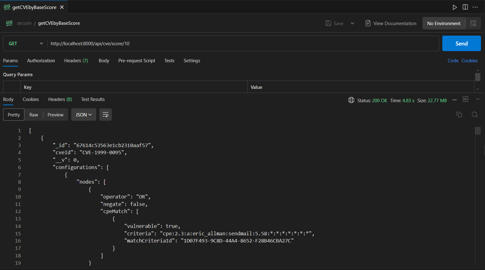
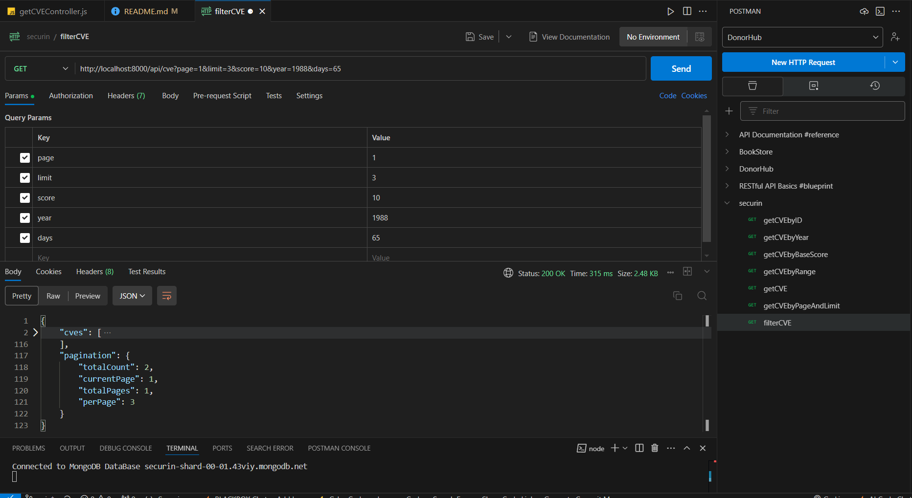
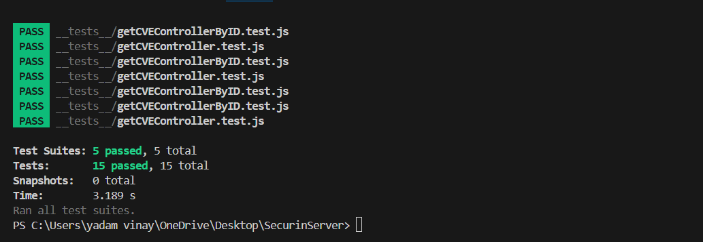

# Securin CVE server

This is the backend for the Securin CVE Dashboard, built with Node.js and Express.js. It provides APIs to fetch, store, and manage CVE (Common Vulnerabilities and Exposures) data.

- Used this API link: https://services.nvd.nist.gov/rest/json/cves/2.0
- Fetched the CVE data in chunks of around 2000 records per request synchronously
- API request is being hit 3 times per each chunk to establish proper connection
- fetching and auto-update of records will be scheduled automatically daily at 02:00 AM(customizable)
- stored the data using bulkWrite into monogoDB(mongoose) database.

My deployed link: https://securinserver.onrender.com/

## Salient Features

- RESTful APIs to fetch CVE data.
- Pagination support for large datasets.
- Filter data based on parameters
- Get sorted data based on published year or lastModified year
- Customizable results per page.
- Auto-Update of records daily at 02:00 AM using node-cron
- Data storage using MongoDB(mongoose).
- Environment variable support for secure configurations

## Tech Stack

- Node.js - JavaScript runtime.
- Express.js - Web framework for Node.js.
- MongoDB - NoSQL database.
- Mongoose - online version of MongoDB.
- dotenv - Environment variable management.
- Jest - JavaScript testing framework.

## Install Packages and Run the App

- Clone the repository

```bash
  git clone https://github.com/YadamVinay369/SecurinServer.git
```

- Install dependencies

```bash
  npm install
```

- Create a `.env` file in the root directory.
- Add the following configuration:

```bash
 PORT=8000
 MONGODB_URI=your_mongodb_connection_string
```

- Run the server

```bash
  npm start
```

- Or for development:

```bash
  npm run dev
```

- Server will run at: http://localhost:8000

## API Reference

#### Get all CVEs

```http
  GET /api/cve
```


#### Get all CVEs with page and limit

```http
  GET /api/cve?page=1&limit=10
```


#### Get CVE based on `id`

```http
  GET /api/cve/:id
```

| Parameter | Type     | Description                      |
| :-------- | :------- | :------------------------------- |
| `id`      | `string` | **Required**. Id of CVE to fetch |


#### Get CVE based on published `year`

```http
  GET /api/cve/year/:year
```

| Parameter | Type     | Description                         |
| :-------- | :------- | :---------------------------------- |
| `year`    | `string` | **Required**. published year of CVE |


#### Get CVE based on `baseScore`

```http
  GET /api/cve/score/:score
```

| Parameter | Type     | Description                    |
| :-------- | :------- | :----------------------------- |
| `score`   | `string` | **Required**. baseScore of CVE |



#### Get CVE based on `range`

```http
  GET /api/cve/lastModified/:range
```

| Parameter | Type     | Description                            |
| :-------- | :------- | :------------------------------------- |
| `range`   | `string` | **Required**. range of values to fetch |


#### filter CVEs by passing queries in the API

```http
  GET /api/cve?page=1&limit=3&score=10&year=1988&days=65
```



## Running Tests

- Install Jest (if not already installed):

```bash
  npm install jest --save-dev
```

- Run the tests:

```bash
  npm test
```

- Tests are located in the `__tests__` folder, including:

- Unit tests for `getCVEController` logic is present in `__tests__\getCVEController.test.js`.
- Unit tests for `getCVEControllerByID` logic is present in `__tests__\getCVEControllerByID.test.js`.
- Unit tests for `getCVEControllerByYear` logic is present in `__tests__\getCVEControllerByYear.test.js`.
- Unit tests for `getCVEControllerByScore` logic is present in `__tests__\getCVEControllerByScore.test.js`.
- Unit tests for `getCVEControllerByRange` logic is present in `__tests__\getCVEControllerByRange.test.js`.



## Dependencies

- express: Fast and minimal web framework.
- mongoose: MongoDB object modeling.
- dotenv: Load environment variables.
- axios: For external API requests.
- jest: JavaScript testing framework for unit testing.
- supertest: For testing HTTP requests.
- node-cron: For time-scheduling and auto-update in the database
